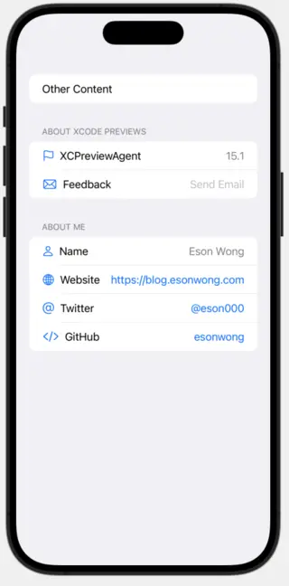

# SwiftUI About View

A simple SwiftUI view to display information about your app and you or your company.

## Screenshots



## Installation

### Swift Package Manager

Add the following to your `Package.swift` file:

```swift
.package(url: "https://github.com/esonwong/SwiftUIAboutView.git", branch: "main")
```

## Usage

```swift
import SwiftUI
import SwiftUIAboutView

struct ContentView: View {
  var body: some View {
    AboutView(
      "Eson Wong",
      website: "https://blog.esonwong.com",
      email: "esonzero@gmail.com",
      twitterId: "eson000",
      githubId: "esonwong") {
        Text("Other Content")
    }
  }
}
```
